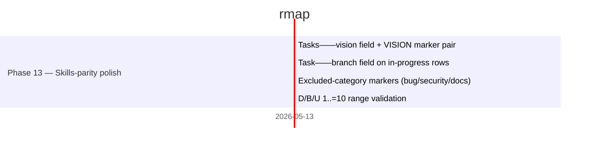

# rmap — Roadmap

`rmap` is a single-binary Rust CLI that manages portable roadmap data (`roadmap/tasks.toml`) for any project. This file is rendered from that source — `rmap render` rewrites only the bytes between the marker pairs below. See [DESIGN.md](DESIGN.md) for the schema contract and the Phase 6 HTML render design, and [CHANGELOG.md](CHANGELOG.md) for shipped phases (1–13a).

## Current Focus

<!-- FOCUS:BEGIN -->
**Focus phase:** 13 — Skills-parity polish (13 of 13 done · 0 in progress)

**Last shipped:** Task 1 — Tasks::vision field + VISION marker pair, Task 2 — Task::branch field on in-progress rows, Task 3 — Excluded-category markers (bug/security/docs), Task 4 — D/B/U 1..=10 range validation on 2026-05-13

**Up next:** Task 9 — rmap render --html --multi portfolio view [D:6/B:6/U:5 → Eff:0.92] ⚠️
<!-- FOCUS:END -->

## Gantt

<!-- MERMAID:BEGIN -->

<!-- MERMAID:END -->

## Phase 13 — Skills-parity polish (done)

🎁 `schema_parity` — additive schema fields (`vision`, `branch`, `bug`/`security`/`docs` markers) plus D/B/U range validation.
🎁 `delegate_parity` — `rmap delegate` prompt shape matches `task-writing.md` (`files_to_modify`, `out_of_scope`, section restructure).
🎁 `doctor_tuning` — CLI overrides for `rmap doctor`'s hardcoded thresholds (`--threshold-days`, `--ac-threshold`).

Phase 13a (Eff-tier glyph + phase archive collapse) shipped 2026-05-13 — see [CHANGELOG.md](CHANGELOG.md#phase-13a-render-polish--eff-tier-glyph--phase-archive-collapse).

<!-- TASKS:BEGIN phase=13 -->
> 13 tasks. See [CHANGELOG.md](CHANGELOG.md#phase-13-skills-parity-polish).
<!-- TASKS:END -->

## Phase 6 — HTML render (planned)

🎁 `html_single` — `rmap render --html` single-project static view.
🎁 `html_portfolio` — `rmap render --html --multi` cross-repo dashboard.

Full design lives in [DESIGN.md § HTML render design (Phase 6)](DESIGN.md#html-render-design-phase-6).

<!-- TASKS:BEGIN phase=6 -->
| Task | Status | Notes |
|------|--------|-------|
| Task 8 | ✅ | 🎁 **html_single** · rmap render --html single-project view [D:6/B:7/U:6 → Eff:1.08] 📋 |
| Task 9 | ⬜ | 🎁 **html_portfolio** · rmap render --html --multi portfolio view [D:6/B:6/U:5 → Eff:0.92] ⚠️ |
<!-- TASKS:END -->

## Phase 7 — `rmap watch` (optional)

🎁 `watch_core` — FS-watch render loop for live dev.
🎁 `watch_stream` — optional `--json` event stream on top of the watch loop.

<!-- TASKS:BEGIN phase=7 -->
> 2 tasks. See [CHANGELOG.md](CHANGELOG.md#phase-7-rmap-watch-optional).
<!-- TASKS:END -->
