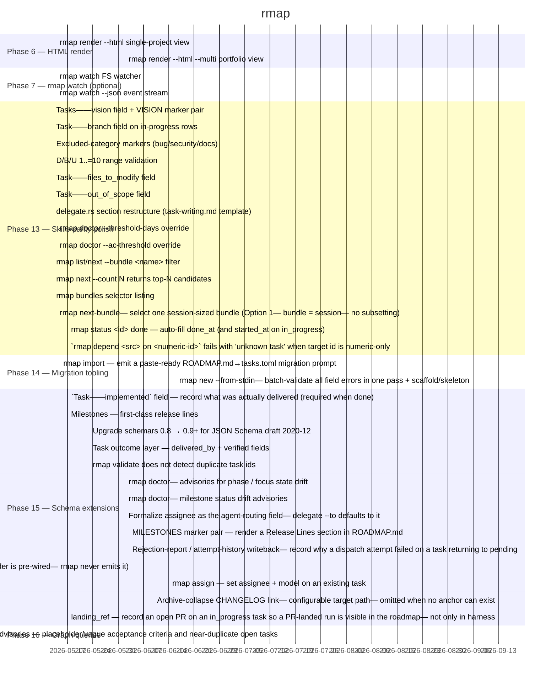

# rmap — Roadmap

`rmap` is a single-binary Rust CLI that manages portable roadmap data (`roadmap/tasks.toml`) for any project. This file is rendered from that source — `rmap render` rewrites only the bytes between the marker pairs below. See [DESIGN.md](DESIGN.md) for the schema contract and the Phase 6 HTML render design, and [CHANGELOG.md](CHANGELOG.md) for shipped phases (1–13a).

## Current Focus

<!-- FOCUS:BEGIN -->
**Focus phase:** not set — add [focus] to tasks.toml
<!-- FOCUS:END -->

## Gantt

<!-- MERMAID:BEGIN -->

<!-- MERMAID:END -->

## Phase 13 — Skills-parity polish (done)

🎁 `schema_parity` — additive schema fields (`vision`, `branch`, `bug`/`security`/`docs` markers) plus D/B/U range validation.
🎁 `delegate_parity` — `rmap delegate` prompt shape matches `task-writing.md` (`files_to_modify`, `out_of_scope`, section restructure).
🎁 `doctor_tuning` — CLI overrides for `rmap doctor`'s hardcoded thresholds (`--threshold-days`, `--ac-threshold`).

Phase 13a (Eff-tier glyph + phase archive collapse) shipped 2026-05-13 — see [CHANGELOG.md](CHANGELOG.md#phase-13a-render-polish--eff-tier-glyph--phase-archive-collapse).

<!-- TASKS:BEGIN phase=13 -->
> 16 tasks. See [CHANGELOG.md](CHANGELOG.md#phase-13-skills-parity-polish).
<!-- TASKS:END -->

## Phase 6 — HTML render (planned)

🎁 `html_single` — `rmap render --html` single-project static view.
🎁 `html_portfolio` — `rmap render --html --multi` cross-repo dashboard.

Full design lives in [DESIGN.md § HTML render design (Phase 6)](DESIGN.md#html-render-design-phase-6).

<!-- TASKS:BEGIN phase=6 -->
| Task | Status | Notes |
|------|--------|-------|
| Task 8 | ✅ | 🎁 **html_single** · rmap render --html single-project view [D:6/B:7/U:6 → Eff:1.08?] 📋 |
| Task 9 | ✅ | 🎁 **html_portfolio** · rmap render --html --multi portfolio view [D:6/B:6/U:5 → Eff:0.92?] ⚠️ |
<!-- TASKS:END -->

## Phase 7 — `rmap watch` (done)

🎁 `watch_core` — FS-watch render loop for live dev.
🎁 `watch_stream` — optional `--json` event stream on top of the watch loop.

<!-- TASKS:BEGIN phase=7 -->
> 2 tasks. See [CHANGELOG.md](CHANGELOG.md#phase-7-rmap-watch-optional).
<!-- TASKS:END -->

## Phase 14 — Migration tooling (done)

🎁 `import_command` — `rmap import` paste-ready ROADMAP.md→tasks.toml migration prompt.

<!-- TASKS:BEGIN phase=14 -->
> 2 tasks. See [CHANGELOG.md](CHANGELOG.md#phase-14-migration-tooling).
<!-- TASKS:END -->

## Phase 15 — Schema extensions (done)

🎁 `agent_routing` — per-task LLM model pinning (`Task::model`, surfaced by `rmap delegate`).

<!-- TASKS:BEGIN phase=15 -->
| Task | Status | Notes |
|------|--------|-------|
| Task 19 | ✅ | 🎁 **agent_routing** · Task::model field — per-task LLM model pinning [D:3/B:5/U:5 → Eff:1.67?] 🚀 |
| Task 22 | ✅ | 🎁 **schema_implemented** · `Task::implemented` field — record what was actually delivered (required when done) [D:4/B:6/U:7 → Eff:1.62?] 🚀 |
| Task 24 | ✅ | 🎁 **schema_milestones** · Milestones — first-class release lines [D:6/B:8/U:8 → Eff:1.33?] 📋 |
| Task 25 | ✅ | 🎁 **schema_milestones** · 🐛 Backfill creation paths with branch / files_to_modify / cross_repo (converge StdinTask/NewTaskFields mirror) [D:4/B:6/U:6 → Eff:1.5?] 🚀 |
| Task 26 | ✅ | 🎁 **deps_schemars** · Upgrade schemars 0.8 → 0.9+ for JSON Schema draft 2020-12 [D:3/B:3/U:3 → Eff:1.0?] 📋 |
| Task 27 | ✅ | 🎁 **schema_milestones** · Active-milestone preference in `rmap next` [D:3/B:5/U:6 → Eff:1.83?] 🚀 |
| Task 28 | ✅ | 🎁 **schema_outcome** · Task outcome layer — delivered_by + verified fields [D:4/B:6/U:6 → Eff:1.5?] 🚀 |
| Task 29 | ✅ | 🎁 **schema_milestones** · 🐛 rmap new allocates a colliding task id on a string-id roadmap [D:3/B:7/U:6 → Eff:2.17?] 🎯 |
| Task 30 | ✅ | 🎁 **schema_milestones** · 🐛 rmap validate does not detect duplicate task ids [D:3/B:6/U:5 → Eff:1.83?] 🚀 |
| Task 31 `[CX]` | ✅ | 🎁 **doctor_state_drift** · rmap doctor: advisories for phase / focus state drift [D:2/B:6/U:7 → Eff:3.25?] 🎯 |
| Task 32 | ✅ | 🎁 **doctor_state_drift** · rmap doctor: milestone status drift advisories [D:2/B:5/U:6 → Eff:2.75?] 🎯 |
| Task 33 | ✅ | 🎁 **schema_outcome** · `--shipped-in` flag on `rmap status` — complete the outcome layer [D:2/B:6/U:6 → Eff:3.0?] 🎯 |
| Task 34 | ✅ | 🎁 **schema_outcome** · `--reason` flag on `rmap status` — settable + rendered + auto-cleared blocked_reason [D:3/B:6/U:6 → Eff:2.0?] 🎯 |
| Task 35 | ✅ | 🎁 **agent_dispatch** · rmap ready — parallel-safe dep-satisfied dispatch set [D:3/B:8/U:9 → Eff:2.83?] 🎯 |
| Task 36 | ✅ | 🎁 **agent_dispatch** · dep_layer — topo depth as a computed --json field [D:3/B:6/U:7 → Eff:2.17?] 🎯 |
| Task 37 | ✅ | 🎁 **agent_dispatch** · touches — advisory collision-prediction field [D:3/B:6/U:8 → Eff:2.33?] 🎯 |
| Task 38 | ✅ | 🎁 **agent_dispatch** · handbuild marker + --dispatchable + --fields JSON projection [D:3/B:6/U:7 → Eff:2.17?] 🎯 |
| Task 39 | ✅ | 🎁 **delegate_targets** · Widen delegate targets + assignee set: add grok, antigravity, pi, droid [D:3/B:6/U:7 → Eff:2.17?] 🎯 |
| Task 40 | ✅ | 🎁 **agent_routing** · Formalize assignee as the agent-routing field; delegate --to defaults to it [D:3/B:7/U:8 → Eff:2.5?] 🎯 |
| Task 41 | ✅ | 🎁 **schema_milestones** · MILESTONES marker pair — render a Release Lines section in ROADMAP.md [D:3/B:6/U:6 → Eff:2.0?] 🎯 |
| Task 42 | ✅ | 🎁 **attempt_history** · Rejection-report / attempt-history writeback: record why a dispatch attempt failed on a task returning to pending [D:4/B:7/U:6 → Eff:1.62?] 🚀 |
| Task 43 | ✅ | 🎁 **agent_routing** · Add `domains` task field: schema + JSON/data.json export (harness CapabilityScore reader is pre-wired, rmap never emits it) [D:2/B:4/U:4 → Eff:2.0?] 🎯 |
| Task 44 | ✅ | 🎁 **doctor_state_drift** · rmap validate: hard error when a live agent-assigned task has no model [D:2/B:4/U:4 → Eff:2.0?] 🎯 |
| Task 49 | ✅ | 🎁 **agent_dispatch** · rmap assign — set assignee + model on an existing task [D:2/B:5/U:5 → Eff:2.5?] 🎯 |
| Task 53 `[P]` | ✅ | 🎁 **delegate_targets** · Add kimi as a first-class agent target (assignee + delegate --to) [D:2/B:6/U:6 → Eff:3.0?] 🎯 |
| Task 55 | ✅ | 🎁 **render_changelog_link** · Archive-collapse CHANGELOG link: configurable target path, omitted when no anchor can exist [D:3/B:5/U:4 → Eff:1.5] 🚀 |
| Task 56 | ✅ | 🎁 **schema_outcome** · landing_ref — record an open PR on an in_progress task so a PR-landed run is visible in the roadmap, not only in harness [D:4/B:6/U:6 → Eff:1.5] 🚀 |
<!-- TASKS:END -->

## Phase 16 — Graph queries (in progress)

🎁 `graph_queries` — expose the already-computed dependency graph as first-class read queries: reverse traversal (`blocks`/`deps`), computed unlock leverage, critical path, graph-health advisories, and DOT/waves export.

<!-- TASKS:BEGIN phase=16 -->
| Task | Status | Notes |
|------|--------|-------|
| Task 45 | ✅ | 🎁 **graph_queries** · Reverse-dependency traversal: unlocks computed field + rmap blocks / rmap deps commands [D:3/B:6/U:7 → Eff:2.17?] 🎯 |
| Task 46 | ✅ | 🎁 **graph_queries** · rmap critical-path: longest dependency chain to a milestone/release [D:3/B:5/U:5 → Eff:1.67?] 🚀 |
| Task 47 | ✅ | 🎁 **graph_queries** · rmap doctor graph-health advisories: bottleneck + isolated/unreachable node [D:3/B:4/U:4 → Eff:1.33?] 📋 |
| Task 48 | ✅ | 🎁 **graph_queries** · rmap graph export: rmap export dot (Graphviz) + rmap waves (parallel dispatch schedule) [D:2/B:4/U:4 → Eff:2.0?] 🎯 |
| Task 51 | ✅ | 🎁 **doctor_spec_quality** · doctor: spec-quality advisories — placeholder/vague acceptance criteria and near-duplicate open tasks [D:4/B:7/U:7 → Eff:1.75?] 🚀 |
| Task 54 `[P]` | ✅ | 🎁 **schema_parity** · Per-task target repo: let one roadmap schedule work that lands in a different repository [D:3/B:5/U:5 → Eff:1.67?] 🚀 |
<!-- TASKS:END -->
