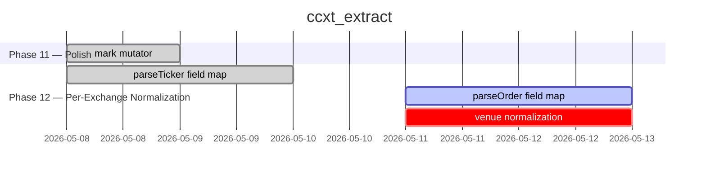

# Project Roadmap

Hand-written intro stays exactly here.

<!-- MERMAID:BEGIN -->

<!-- MERMAID:END -->

## Phase 11

<!-- TASKS:BEGIN phase=11 -->
| Task | Status | Notes |
|------|--------|-------|
| Task 70 | ✅ | 🎁 **polish** · mark mutator [D:2/B:4/U:4 → Eff:2.0] 🎯 |
<!-- TASKS:END -->

## Phase 12

<!-- TASKS:BEGIN phase=12 -->
| Task | Status | Notes |
|------|--------|-------|
| Task 74 | ✅ | 🎁 **ticker_normalization** · parseTicker field map [D:5/B:8/U:8 → Eff:1.6] 🚀 |
| Task 75 | 🔄 | 🎁 **order_normalization** · parseOrder field map [D:6/B:8/U:8 → Eff:1.33] 📋 |
| Task 76 | 🔶 | 🎁 **order_normalization** · venue normalization [D:3/B:6/U:5 → Eff:1.83] 🚀 |
| Task 77 | ⬜ | 🎁 **order_normalization** · emit normalized errors [D:2/B:8/U:8 → Eff:4.0] 🎯 |
<!-- TASKS:END -->

Hand-written outro stays too.
